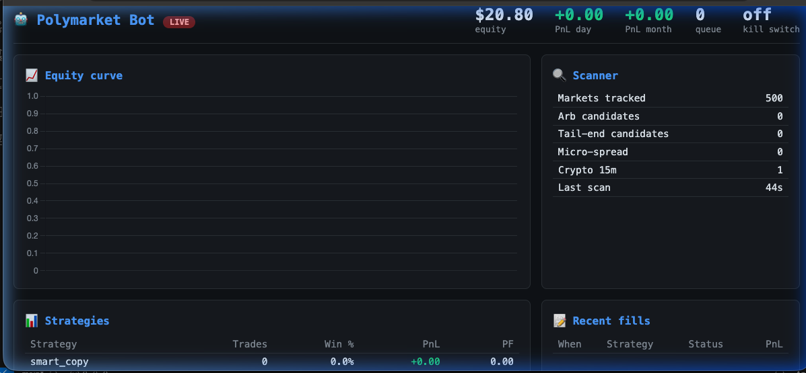

# Polymarket Multi-Strategy Trading Bot

An autonomous, multi-strategy trading bot for
[Polymarket](https://polymarket.com) on Polygon. It does **not** blindly
copy trades — it scans every active market on a 5-second cadence,
classifies opportunities into seven tactical buckets, and runs them
through a centralized risk manager before touching a single USDC.

```
┌─────────────────────────────────────────────────────────────────┐
│                      MarketScanner (5 s loop)                   │
│     Gamma /markets   +   CLOB /book  →  MarketSnapshot          │
└───────────────┬─────────────────────────────────────────────────┘
                │   (shared read-only snapshot)
   ┌────────────┼────────────┬─────────────┬──────────────┐
   ▼            ▼            ▼             ▼              ▼
Arbitrage  Tail-End    Micro-Spread   DipArb        Smart-Copy ...
(prio 0)   (prio 10)   (prio 20)      (prio 15)     (prio 30)
   │            │            │             │              │
   └─────────→  OpportunityQueue  (min-heap, dedup) ◀──────┘
                             │
                             ▼
                ┌─────────────────────────────┐
                │          Executor           │
                │  risk.allow()  +  slippage  │
                │  paper : [SIMULADO]         │
                │  live  : py-clob-client-v2 FOK │
                └─────────────┬───────────────┘
                              │
                 state.json / Supabase / Telegram
```

### Live Dashboard



---

## Highlights

* **7 strategies** with clear priorities — Arbitrage (sum-to-one),
  Tail-End, Micro-Spread, DipArb (crypto + Binance confirmation),
  Smart-Copy (elite-wallet filters), Market-Making (maker rebates on
  15-min crypto), and a deep-discount Sniper ladder.
* **Strict risk manager** — per-market and per-strategy exposure caps,
  daily / monthly loss caps, 10% drawdown triggers 50% sizing, four
  consecutive losses pause a strategy for an hour, API-error streak
  triggers a global pause.
* **Budget-aware** — `BudgetProfile` auto-classifies your capital into
  micro (≤ $50), small (≤ $300), standard (≤ $5k) or large tiers and
  picks sensible sizes, caps and allowed strategies. Works on a $20–$30
  account out of the box — see [docs/LOW_BUDGET_GUIDE.md](docs/LOW_BUDGET_GUIDE.md).
* **Encrypted wallet** — Tier 1 keyring + Fernet by default; Tier 2
  hardware, Tier 3 multi-wallet rotation and Tier 4 Cloud KMS stubs
  for larger accounts. See [docs/WALLET_SECURITY.md](docs/WALLET_SECURITY.md).
* **Paper trading first** — `MODE=paper` exercises the full pipeline
  (scanner, strategies, queue, risk, slippage, executor, notifications)
  without a single on-chain transaction.
* **Async, single-process** — one executor consumer, one scanner, one
  strategy loop per enabled strategy. Fits on a Mac Mini or a 1-CPU
  VPS.
* **Textual TUI** with reactive per-strategy stats, opportunity queue,
  equity sparkline, and an interactive command bar (`/arb off`,
  `/size tail_end 50`, `/pause`, `/resume 30m`, `/pnl week`, ...).
* **Optional web dashboard** — `python main.py --dashboard web` spins
  up a FastAPI + Chart.js page on `localhost:8080` with live WebSocket
  updates.
* **Multi-channel notifications** — desktop toasts (plyer), sound beeps
  (beepy), Telegram (optional), email SMTP for criticals. Telegram is
  **no longer required**.
* **Hot-reload config** — edit `config_live.yaml` and the bot picks up
  changes in under a second via watchdog. No restart required.
* **Session reports** — HTML session summary written on shutdown with
  equity curve, per-strategy stats, skip histogram and recommendations.
* **Prometheus metrics** — opt in with `--metrics`; exposes
  `bot_trades_total`, `bot_scan_duration_seconds`, `bot_equity_usdc`,
  etc. on `:9090`.
* **68 passing unit tests** covering risk manager, priority queue,
  arbitrage, tail-end, smart-copy scoring, backtest engine,
  notifications, wallet keyring, command processor, config watcher and
  budget profile.

---

## Quickstart

```bash
git clone https://github.com/RanuK12/Ranuk-Copy-Trading.git
cd Ranuk-Copy-Trading

python3 -m venv .venv
source .venv/bin/activate
pip install -r requirements.txt

# One-time: encrypt your private key in the OS keyring
python main.py --setup-wallet

cp .env.example .env
# → edit .env: MODE, RPC URLs, POLY_FUNDER, TOTAL_CAPITAL_USDC

# Run in paper mode (default) with the Textual TUI
python main.py

# Other entrypoints:
python main.py --command "status"       # one-shot CLI
python main.py --command "pnl week"     # print and exit
python main.py --dashboard web          # web dashboard on :8080
python main.py --dashboard tui+web      # both dashboards at once
python main.py --metrics                # also expose :9090/metrics
```

Stop with `Ctrl-C`; state is persisted to `bot_state.json` and an HTML
session report is written to `logs/session_YYYYMMDD_HHMMSS.html`.

Full installation and configuration walkthrough: **[docs/SETUP.md](docs/SETUP.md)**.
Per-strategy explanations and tuning guidance: **[docs/STRATEGIES.md](docs/STRATEGIES.md)**.
Wallet tiers and threat model: **[docs/WALLET_SECURITY.md](docs/WALLET_SECURITY.md)**.
Running on $20–$30: **[docs/LOW_BUDGET_GUIDE.md](docs/LOW_BUDGET_GUIDE.md)**.
Wiring the bot to your Polymarket account and depositing USDC (**Spanish**):
**[docs/CONECTAR_WALLET.md](docs/CONECTAR_WALLET.md)**.

---

## Repository layout

```
Ranuk-Copy-Trading/
├── main.py                          # async orchestrator + CLI dispatch
├── ecosystem.config.js              # PM2 process definition
├── pytest.ini
├── requirements.txt
├── .env.example
├── config_live.yaml.example         # hot-reloadable runtime config
├── docs/
│   ├── SETUP.md                     # install + RPC + Supabase + Telegram
│   ├── STRATEGIES.md                # per-strategy guide
│   ├── WALLET_SECURITY.md           # 4 wallet tiers + threat model  (v3)
│   ├── LOW_BUDGET_GUIDE.md          # $20-$300 accounts                (v3)
│   └── CONECTAR_WALLET.md           # Spanish wallet-linking walkthrough
├── bot/
│   ├── config.py                    # typed env-driven config
│   ├── logger.py                    # shared Rich console
│   ├── models.py                    # Opportunity, Leg, Fill, priorities
│   ├── queue.py                     # priority heap + dedup
│   ├── risk.py                      # RiskManager (circuit breakers)
│   ├── state.py                     # JSON + Supabase persistence
│   ├── scanner.py                   # 5-second market scanner
│   ├── executor.py                  # order dispatcher
│   ├── core/                        # (v3) BudgetProfile + config watcher
│   │   ├── budget.py
│   │   └── config_watcher.py
│   ├── monitoring/                  # (v3) TUI, commands, notifications, metrics
│   │   ├── tui_app.py               # Textual app
│   │   ├── dashboard.tcss
│   │   ├── commands.py              # shared command processor
│   │   ├── cli.py                   # --command one-shot entry
│   │   ├── notifications.py         # desktop/sound/tg/email router
│   │   ├── log_analyzer.py          # HTML session report
│   │   └── metrics.py               # Prometheus endpoint
│   ├── wallet/                      # (v3) 4-tier wallet security
│   │   ├── base.py
│   │   ├── secure_key.py            # Tier 1 — keyring + Fernet
│   │   ├── plain_env.py             # Tier 0 — backward compat
│   │   ├── hardware_wallet.py       # Tier 2 — Ledger/Trezor (stub)
│   │   ├── multi_wallet.py          # Tier 3 — rotation/assigned
│   │   ├── cloud_kms.py             # Tier 4 — AWS KMS/Vault (stub)
│   │   ├── resolver.py              # env-driven tier selection
│   │   └── wizard.py                # --setup-wallet interactive flow
│   ├── web/                         # (v3) optional web dashboard
│   │   ├── server.py                # FastAPI + WebSocket
│   │   └── static/dashboard.html    # vanilla HTML + Chart.js
│   ├── clients/
│   │   ├── rpc.py                   # Polygon RPC with failover
│   │   ├── polymarket.py            # Gamma + Data + CLOB wrappers
│   │   ├── telegram.py              # (optional) alerts
│   │   ├── binance.py               # CEX confirmation for DipArb
│   │   └── supabase_client.py       # optional fill mirror
│   ├── strategies/
│   │   ├── base.py
│   │   ├── arbitrage.py
│   │   ├── tail_end.py
│   │   ├── micro_spread.py
│   │   ├── dip_arb.py
│   │   ├── smart_copy.py
│   │   ├── market_making.py
│   │   └── sniper.py
│   └── backtest/
│       └── engine.py                # historical backtest harness
└── tests/
    ├── conftest.py
    ├── test_risk.py                 # 9 tests
    ├── test_queue.py                # 4 tests
    ├── test_arbitrage.py            # 4 tests
    ├── test_tail_end.py             # 5 tests
    ├── test_smart_copy_scoring.py   # 4 tests
    ├── test_backtest.py             # 1 test
    ├── test_notifications.py        # 6 tests    (v3)
    ├── test_wallet_keyring.py       # 7 tests    (v3)
    ├── test_tui_commands.py         # 15 tests   (v3)
    ├── test_config_watcher.py       # 5 tests    (v3)
    └── test_budget.py               # 8 tests    (v3)
```

---

## Safety

* `.env` is git-ignored and must never be committed.
* The bot refuses to run in `MODE=live` without a private key and
  funder address.
* The risk manager is the only path to the executor — every opportunity
  is gated on exposure, loss caps, drawdown, and pause state.
* The Telegram `/emergencystop` flips a kill switch that blocks **all**
  new orders instantly. Already-resting GTC orders are untouched; use
  the Polymarket UI or an operator script to cancel them if needed.
* This is a personal-use tool. It is **not** financial advice and
  **not** audited. Run it in paper mode first, expect bugs, never
  risk more than you can afford to lose.

---

## Running the tests

```bash
pytest -q
# 68 passed
```

---

## Further reading and references

Architecture and API patterns informed by:

* <https://github.com/HKUDS/Vibe-Trading> — backtesting framework, risk
  management, multi-strategy orchestration.
* <https://github.com/GiordanoSouza/polymarket-copy-trading-bot> —
  Supabase realtime, position sizing.
* <https://github.com/direkturcrypto/polymarket-terminal> — maker-rebate
  MM, ghost-fill recovery, WebSocket RTDS.
* [Polymarket docs](https://docs.polymarket.com), especially the
  [CLOB quickstart](https://docs.polymarket.com/trading/quickstart) and
  [WebSocket overview](https://docs.polymarket.com/market-data/websocket/overview).


## Licencia

MIT — © 2026 Ranuk IT Solutions | [ranuk.dev](https://ranuk.dev)
